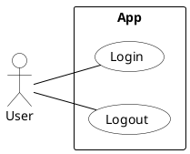

# Spécifications : PlantUML (Use Case)

## üìå Usage
Utilisé principalement pour les **Diagrammes de Cas d'Utilisation** lors de la phase d'**Analyse**.

## üìù Syntaxe & Bonnes Pratiques

### Configuration Globale
Toujours inclure :
```puml
@startuml
left to right direction
skinparam packageStyle rectangle

' Schéma de couleurs : noir sur blanc uniquement
skinparam actorBackgroundColor white
skinparam actorBorderColor black
skinparam usecaseBackgroundColor white
skinparam usecaseBorderColor black
skinparam packageBackgroundColor white
skinparam packageBorderColor black
skinparam arrowColor black

' ... content
@enduml
```

### Acteurs
Définir les acteurs avec des alias :
```puml
actor "Visiteur" as Guest
actor "Administrateur" as Admin
```

### Cas d'Utilisation (Use Cases)
Regrouper les cas dans un `package` ou `rectangle` représentant le système :
```puml
rectangle "Système Blog" {
  usecase "Lire un article" as UC1
  usecase "Se connecter" as UC2
}
```

### Relations
- **Association simple (Acteur ↔ Cas d'Utilisation)** : `Actor -- Usecase` (SANS orientation, pas de flèches)
- **Inclusion** (Obligatoire) : `UC1 ..> UC2 : <<include>>`
- **Extension** (Optionnel) : `UC1 <.. UC2 : <<extend>>`
- **Généralisation** : `Admin --|> Guest`

### ⚠️ Règles Importantes
1. **Relations Acteur-UseCase** : Toujours utiliser `--` (sans flèche) pour les associations entre acteurs et cas d'utilisation.
2. **Couleurs** : Schéma monochrome obligatoire (noir sur blanc) pour tous les éléments.

## üí° Exemple Type

```puml
@startuml
left to right direction
skinparam packageStyle rectangle

' Schéma de couleurs monochrome
skinparam actorBackgroundColor white
skinparam actorBorderColor black
skinparam usecaseBackgroundColor white
skinparam usecaseBorderColor black
skinparam packageBackgroundColor white
skinparam packageBorderColor black
skinparam arrowColor black

actor "User" as U
rectangle "App" {
  usecase "Login" as UC1
  usecase "Logout" as UC2
}
U -- UC1
U -- UC2
@enduml
```
