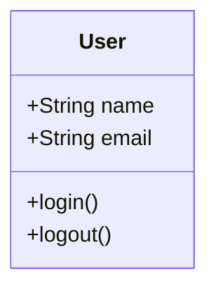
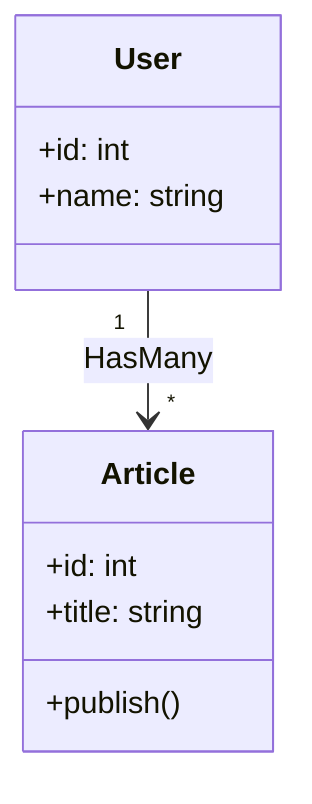

# Spécifications : Mermaid JS (Class Diagram)

## 📌 Usage
Utilisé principalement pour les **Diagrammes de Classes** (Model) lors de la phase de **Conception**.

## 📝 Syntaxe & Bonnes Pratiques

### En-tête
Commencer par `classDiagram`.

### Définition des Classes

### Relations
- **Héritage** : `Child --|> Parent`
- **Composition** : `Whole *-- Part`
- **Agrégation** : `Whole o-- Part`
- **Association** : `ClassA --> ClassB`

### Multiplicité
Ajouter les cardinalités si nécessaire :
`User "1" --> "*" Article : writes`

## 💡 Exemple Type (Laravel Model)

