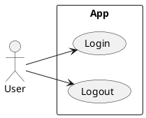

# Spécifications : PlantUML (Use Case)

## 📌 Usage
Utilisé principalement pour les **Diagrammes de Cas d'Utilisation** lors de la phase d'**Analyse**.

## 📝 Syntaxe & Bonnes Pratiques

### Configuration Globale
Toujours inclure :
```puml
@startuml
left to right direction
skinparam packageStyle rectangle
' ... content
@enduml
```

### Acteurs
Définir les acteurs avec des alias :
```puml
actor "Visiteur" as Guest
actor "Administrateur" as Admin
```

### Cas d'Utilisation (Use Cases)
Regrouper les cas dans un `package` ou `rectangle` représentant le système :
```puml
rectangle "Système Blog" {
  usecase "Lire un article" as UC1
  usecase "Se connecter" as UC2
}
```

### Relations
- **Association simple** : `Actor -- Usecase`
- **Inclusion** (Obligatoire) : `UC1 ..> UC2 : <<include>>`
- **Extension** (Optionnel) : `UC1 <.. UC2 : <<extend>>`
- **Généralisation** : `Admin --|> Guest`

## 💡 Exemple Type

